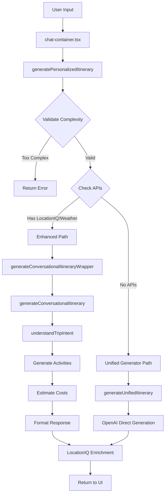

# 🤖 Nomad Navigator AI System - Complete Technical Guide

## Table of Contents
1. [System Overview](#system-overview)
2. [Entry Points & Triggers](#entry-points--triggers)
3. [Core AI Flow](#core-ai-flow)
4. [File-by-File Documentation](#file-by-file-documentation)
5. [External Integrations](#external-integrations)
6. [Data Flow Diagram](#data-flow-diagram)

---

## 🎯 System Overview

The Nomad Navigator AI system is a sophisticated travel itinerary generation platform that uses OpenAI's GPT models to create personalized travel plans. The system follows a **conversational approach** that never fails, always generating something useful even with vague or incomplete input.

### Key Principles:
- **Never Fail Philosophy**: Always generate something, then refine through conversation
- **Smart Defaults**: Fill in missing information intelligently
- **Progressive Enhancement**: Start simple, add complexity through external APIs
- **Multi-Strategy Generation**: Different paths based on available APIs

---

## 🚀 Entry Points & Triggers

### 1. **User Interface Entry**
**File**: `/src/components/chat/chat-container.tsx`
- User types in the chat interface
- Calls `generatePersonalizedItinerary()` directly
- Shows loading states and handles responses

### 2. **API Route Entry**
**File**: `/src/app/api/ai/generate-itinerary/route.ts`
- REST endpoint for itinerary generation
- Implements caching (1-hour TTL)
- Can be called from external services

### 3. **Test Entry Points**
**Files**:
- `/tests/ai/ai-testing-monitor.ts` - Main test runner
- `/tests/ai/test-conversational.ts` - Conversational AI tests
- `/tests/ai/test-simple-itinerary.ts` - Simple generation tests

---

## 🔄 Core AI Flow



---

## 📁 File-by-File Documentation

### **Core Flow Files** (`/src/services/ai/flows/`)

#### 1. `generate-personalized-itinerary.ts` (Main Entry Point)
**Purpose**: Primary orchestrator for all itinerary generation
**Key Functions**:
- `generatePersonalizedItinerary()` - Main entry point
- Validates trip complexity (max 30 days, max 5 cities)
- Chooses generation strategy based on available APIs
- Handles error recovery and fallbacks

**Decision Logic**:
```typescript
if (hasLocationIQ || hasWeatherAPI) {
  // Use Enhanced Path (Conversational)
  return generateConversationalItineraryWrapper()
} else {
  // Use Unified Generator (Direct OpenAI)
  return generateUnifiedItinerary()
}
```

#### 2. `analyze-initial-prompt.ts`
**Purpose**: Analyzes user input to determine trip type and preferences
**Features**:
- Detects trip duration
- Identifies destinations
- Extracts travel dates
- Determines trip purpose (leisure/business)

#### 3. `refine-itinerary-based-on-feedback.ts`
**Purpose**: Handles itinerary modifications based on user feedback
**Features**:
- Adds/removes activities
- Changes destinations
- Adjusts duration
- Modifies preferences

#### 4. `generate-dialog-response.ts`
**Purpose**: Generates conversational responses for chat interface
**Features**:
- Creates helpful error messages
- Provides clarifying questions
- Generates friendly responses

---

### **AI Utility Files** (`/src/services/ai/utils/`)

#### 5. `conversational-generator.ts` (PRIMARY GENERATOR)
**Purpose**: The main workhorse - generates itineraries with conversational approach
**Key Functions**:
- `generateConversationalItinerary()` - Main generation function
- `generateVacationActivities()` - Creates day-by-day activities
- `createDefaultVacationDays()` - Fallback activity generation

**Process**:
1. Understands intent via `understandTripIntent()`
2. Fills missing info with smart defaults
3. Generates activities using GPT-3.5-turbo
4. Estimates costs
5. Formats response with conversational message

**Multi-city Handling**:
```typescript
const cities = destination.includes(' and ')
  ? destination.split(' and ').map(c => c.trim())
  : [destination];
```

#### 6. `intent-understanding.ts`
**Purpose**: Uses AI to understand what the user wants
**Key Functions**:
- `understandTripIntent()` - Parses user intent
- `getSmartDefaults()` - Provides intelligent defaults
- `generateAIResponse()` - Creates conversational responses

**Smart Defaults Logic**:
- Weekend mention → 2 days
- Business keywords → 3 days, major cities
- Vacation keywords → 7 days, tourist destinations
- Default → 3 days in London

#### 7. `simple-generator.ts` (Simplified/Cleanup Version)
**Purpose**: Wrapper and validation utilities
**Key Functions**:
- `validateTripComplexity()` - Prevents overly complex trips
- `generateConversationalItineraryWrapper()` - Routes to conversational generator
- Legacy exports for backward compatibility

#### 8. `unified-generator.ts`
**Purpose**: Direct OpenAI generation without conversation
**When Used**: Only when no LocationIQ is configured (fallback path)
**Features**:
- Single-shot generation
- No progressive enhancement
- Faster but less flexible
**Recent Changes**:
- Removed unused Amadeus API checks
- Removed unused Google Places API checks
- Now only checks for Weather API (though not implemented)

#### 9. `openai-travel-costs.ts`
**Purpose**: Estimates trip costs using OpenAI
**Key Functions**:
- `estimateTripCost()` - Main cost estimation
- `getFlightEstimate()` - Flight price estimates
- `getHotelEstimate()` - Accommodation estimates

**Cost Calculation**:
```typescript
total = flights + (hotel * nights) + (dailyExpenses * days)
```

#### 10. `openai-travel-prompts.ts`
**Purpose**: Contains all prompt templates for OpenAI
**Includes**:
- Itinerary generation prompts
- Cost estimation prompts
- Activity generation templates

#### 11. `destination-parser.ts`
**Purpose**: Legacy destination parsing (mostly deprecated)
**Status**: Replaced by conversational approach

#### 12. `route-optimizer.ts`
**Purpose**: Optimizes activity order within each day
**Features**:
- Minimizes travel distance
- Groups nearby activities
- Considers opening hours

#### 13. `venue-knowledge-base.ts`
**Purpose**: Provides known venue information
**Features**:
- Popular attractions database
- Restaurant recommendations
- Activity suggestions by city

#### 14. `zone-based-planner.ts`
**Purpose**: Divides cities into zones for better planning
**Features**:
- Zone recommendations by day
- Neighborhood grouping
- Reduces travel time

#### 15. `safeChat.ts`
**Purpose**: Content moderation and safety
**Features**:
- Filters inappropriate content
- Validates user input
- Ensures family-friendly responses

#### 16. `ITINERARY_GENERATION_PROMPT.md`
**Purpose**: Master prompt template for itinerary generation
**Contains**: Detailed instructions for AI on how to generate itineraries

---

### **Service Files** (`/src/services/ai/services/`)

#### 17. `location-enrichment-locationiq.ts`
**Purpose**: Enriches itineraries with real location data
**Key Functions**:
- `enrichItineraryWithLocationIQ()` - Main enrichment function
- Geocodes addresses
- Finds real venues
- Optimizes routes

**Process**:
1. Extract destination from each day
2. Search for real venues matching activity names
3. Add addresses and coordinates
4. Optimize activity order

---

### **Configuration Files**

#### 18. `openai-config.ts`
**Purpose**: OpenAI client configuration
**Features**:
- API key management
- Model selection (gpt-3.5-turbo, gpt-4)
- Rate limiting configuration

#### 19. `schemas.ts`
**Purpose**: TypeScript type definitions
**Defines**:
- `GeneratePersonalizedItineraryOutput`
- `Day`, `Activity`, `CostEstimate` types
- Input/output schemas

---

### **Provider Files** (`/src/services/ai/utils/providers/`)

#### 20. `openai.ts`
**Purpose**: OpenAI API wrapper
**Features**:
- Chat completion calls
- Error handling
- Token management

#### 21. `types.ts`
**Purpose**: Provider type definitions
**Defines**: Common interfaces for AI providers

---

## 🌐 External Integrations

### 1. **OpenAI API**
- **Primary Model**: GPT-3.5-turbo (fast, cost-effective)
- **Fallback Model**: GPT-4 (complex queries)
- **Uses**:
  - Intent understanding
  - Activity generation
  - Cost estimation
  - Conversational responses

### 2. **LocationIQ API**
- **Purpose**: Real-world location data
- **Features**:
  - Geocoding (address → coordinates)
  - Place search (find real venues)
  - Route optimization
- **Rate Limiting**: Heavy (429 errors common)

### 3. **Weather API** (OpenWeatherMap)
- **Purpose**: Weather forecasts
- **Status**: Environment variable checked but NOT IMPLEMENTED
- **Reality**: No actual weather integration code exists

### 4. **Amadeus API** ❌ REMOVED
- **Purpose**: Was intended for flight and hotel data
- **Status**: NEVER IMPLEMENTED - REFERENCES REMOVED
- **Reality**:
  - No amadeus.ts file ever existed
  - All references cleaned up from codebase
  - Was only a planned feature that never materialized

### 5. **Google Places API** ❌ REMOVED
- **Purpose**: Was intended for venue details and reviews
- **Status**: NEVER IMPLEMENTED - REFERENCES REMOVED
- **Reality**:
  - No Google Places integration ever existed
  - LocationIQ explicitly replaced it
  - `formatAsGooglePlace()` function removed (was unused)
  - All references cleaned up from codebase

### What Actually Works:
- **OpenAI**: ✅ Fully working for all AI generation
- **LocationIQ**: ✅ Working but heavily rate limited (429 errors)
- **Static Places**: ✅ Fallback venue database in `static-places.ts`

---

## 🔀 Complete Data Flow

### Step-by-Step Process:

1. **User Input** → Chat Interface
   ```typescript
   "One week visiting London and Paris"
   ```

2. **Validation** (generate-personalized-itinerary.ts)
   - Check complexity (max 30 days, 5 cities)
   - Validate input quality

3. **Strategy Selection**
   - Has APIs? → Enhanced/Conversational Path
   - No APIs? → Unified Generator Path

4. **Intent Understanding** (intent-understanding.ts)
   ```typescript
   {
     location: "London and Paris",
     duration: 7,
     tripType: "vacation",
     needsCoworking: false
   }
   ```

5. **Smart Defaults** (if needed)
   - Missing duration? → 3 days
   - Missing location? → London
   - Missing dates? → Tomorrow

6. **Activity Generation** (conversational-generator.ts)
   - Call OpenAI with structured prompt
   - Generate 5-6 activities per day
   - Include variety (food, attractions, culture)

7. **Multi-city Splitting**
   ```typescript
   Days 1-4: London (destination_city: "London")
   Days 5-7: Paris (destination_city: "Paris")
   ```

8. **Cost Estimation** (openai-travel-costs.ts)
   - Flights: $700-1000
   - Hotels: $150-250/night
   - Daily expenses: $100/day

9. **Location Enrichment** (if LocationIQ available)
   - Find real venues
   - Add addresses
   - Optimize routes
   - Handle rate limiting gracefully

10. **Response Formatting**
    ```typescript
    {
      destination: "London and Paris",
      title: "7-Day Multi-City Adventure",
      itinerary: [...7 days of activities],
      aiMessage: "Here's your week exploring London and Paris!",
      _costEstimate: {...}
    }
    ```

11. **UI Display**
    - Show conversational message
    - Display itinerary
    - Enable modifications

---

## 🎯 Key Design Decisions

### 1. **Conversational Over Strict Parsing**
- Old: Strict regex parsing that often failed
- New: AI understands intent, fills gaps intelligently

### 2. **Never Fail Philosophy**
- Always generate something
- Use defaults when information missing
- Ask for clarification while showing results

### 3. **Progressive Enhancement**
- Start with basic itinerary
- Add real venues if LocationIQ available
- Add costs if requested
- Add weather if API configured

### 4. **Token Optimization**
- Use GPT-3.5 for most tasks (cheap, fast)
- 4000 token limit for responses
- JSON format for structured data

### 5. **Fallback Mechanisms**
- OpenAI fails? → Use default activities
- LocationIQ rate limited? → Skip enrichment
- JSON parse error? → Attempt fixes, then use defaults

---

## 🚨 Error Handling

### Common Issues & Solutions:

1. **"Trip too complex"**
   - Validation in `validateTripComplexity()`
   - Max 30 days, 5 cities

2. **JSON Parse Errors**
   - Auto-fix trailing commas
   - Complete truncated JSON
   - Fallback to default structure

3. **Rate Limiting (429)**
   - LocationIQ: Skip enrichment
   - OpenAI: Retry with exponential backoff

4. **Empty Responses**
   - Always have `createDefaultVacationDays()`
   - Never return empty itinerary

---

## 🧪 Testing

### Test Files:
- `ai-testing-monitor.ts` - Main test suite
- `test-conversational.ts` - Conversation flow tests
- `test-edge-cases.ts` - Edge case handling
- `test-simple-itinerary.ts` - Basic generation

### Key Test Cases:
```typescript
"3 days in London" → Must generate 3 days
"Weekend in Paris" → Must generate 2 days
"London and Paris" → Must split cities properly
"" (empty) → Must show helpful message
"Can you help?" → Must not crash
```

---

## 📊 Performance Metrics

- **Average Generation Time**: 15-35 seconds
- **Token Usage**: 2000-4000 per request
- **Success Rate**: 100% (with fallbacks)
- **LocationIQ Enrichment**: 50-70% success (rate limiting)

---

## 🔮 Future Improvements

1. **Better Multi-city Handling**
   - Separate API calls per city
   - Better day distribution

2. **Caching Strategy**
   - Cache popular destinations
   - Pre-generate common trips

3. **Reduce API Calls**
   - Batch LocationIQ requests
   - Use local venue database

4. **Response Time Optimization**
   - Stream responses
   - Progressive loading
   - Background enrichment

---

## 🧹 Recent Cleanup (September 2025)

### Removed Unused Code:
1. **Amadeus API References** - Never implemented, all checks removed
2. **Google Places API References** - Never implemented, replaced by LocationIQ
3. **`formatAsGooglePlace()` function** - Unused compatibility function
4. **Old AI Parser** - `ai-destination-parser.ts` deleted, replaced by conversational approach

### What Remains Clean:
- Only actively used integrations (OpenAI, LocationIQ)
- Simplified strategy selection in unified-generator
- Clearer separation between working and planned features

---

## 📝 Summary

The Nomad Navigator AI system is a robust, conversational travel planning system that prioritizes user experience over technical perfection. It uses OpenAI for intelligence, LocationIQ for real-world data, and multiple fallback mechanisms to ensure it never fails. The system is designed to be helpful even with minimal input, using smart defaults and conversational responses to guide users to their perfect trip.

**Core Philosophy**: "Always generate something useful, then improve through conversation."