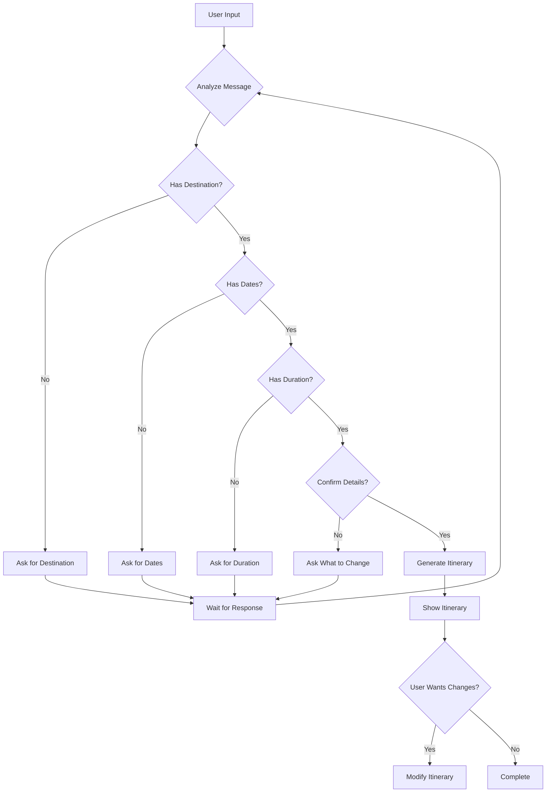
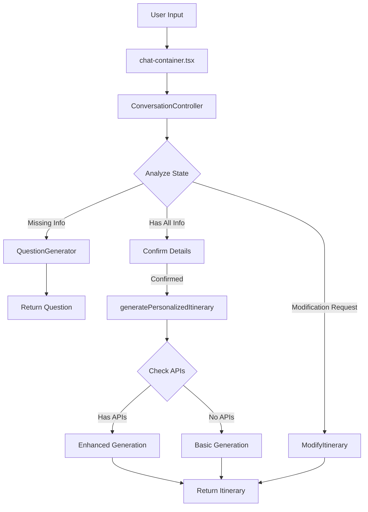

# 🤖 Nomad Navigator AI System - Complete Technical Guide V2
# TRUE CONVERSATIONAL AI - NO DEFAULTS EVER

## ⚠️ CRITICAL CHANGES FROM V1
### This is a COMPLETE PHILOSOPHY CHANGE:
- **V1**: "Never fail - always generate something with defaults"
- **V2**: "Never assume - always ask for information"

### REMOVED FEATURES:
- ❌ NO default destinations (London, Paris fallbacks)
- ❌ NO default dates (tomorrow, next week)
- ❌ NO default durations (3 days)
- ❌ NO automatic generation without user data
- ❌ NO fallback itineraries

### NEW FEATURES:
- ✅ True conversational flow like ChatGPT
- ✅ Asks for missing information
- ✅ Maintains conversation context
- ✅ Allows iterative refinement
- ✅ Natural dialogue progression

---

## Table of Contents
1. [System Overview](#system-overview)
2. [Conversation Flow Architecture](#conversation-flow-architecture)
3. [Entry Points & Triggers](#entry-points--triggers)
4. [Core AI Flow](#core-ai-flow)
5. [File-by-File Documentation](#file-by-file-documentation)
6. [External Integrations](#external-integrations)
7. [Implementation Status](#implementation-status)

---

## 🎯 System Overview

The Nomad Navigator AI system is a conversational travel itinerary generation platform that uses OpenAI's GPT models to create personalized travel plans through natural dialogue. The system **NEVER uses defaults** and always gathers required information through conversation.

### Key Principles:
- **No Defaults Ever**: Never assume destination, dates, or duration
- **Conversational Gathering**: Ask for missing information naturally
- **Progressive Refinement**: Build itinerary through dialogue
- **Context Persistence**: Remember all conversation history
- **Modification Support**: Allow changes after generation

---

## 💬 Conversation Flow Architecture

### State Machine


### Conversation States
```typescript
enum ConversationState {
  GREETING = 'greeting',
  COLLECTING_DESTINATION = 'collecting_destination',
  COLLECTING_DATES = 'collecting_dates',
  COLLECTING_DURATION = 'collecting_duration',
  COLLECTING_TRAVELERS = 'collecting_travelers',
  COLLECTING_PREFERENCES = 'collecting_preferences',
  CONFIRMING_DETAILS = 'confirming_details',
  GENERATING = 'generating',
  SHOWING_ITINERARY = 'showing_itinerary',
  AWAITING_FEEDBACK = 'awaiting_feedback',
  MODIFYING = 'modifying'
}
```

---

## 🚀 Entry Points & Triggers

### 1. **User Interface Entry**
**File**: `/src/components/chat/chat-container.tsx`
- User types in the chat interface
- ~~Calls `generatePersonalizedItinerary()` directly~~ ❌ CHANGES NEEDED
- **NEW**: Routes through conversation controller
- Shows questions, confirmations, and itineraries

### 2. **API Route Entry**
**File**: `/src/app/api/ai/generate-itinerary/route.ts`
- REST endpoint for itinerary generation
- ~~Implements caching (1-hour TTL)~~ ❌ NEEDS UPDATE
- **NEW**: Maintains conversation sessions
- Returns questions or itineraries based on state

### 3. **Test Entry Points**
**Files**:
- `/tests/ai/test-true-conversation.ts` - **NEW** conversation flow tests
- ~~`/tests/ai/test-conversational.ts`~~ - ❌ NEEDS UPDATE
- ~~`/tests/ai/test-simple-itinerary.ts`~~ - ❌ NEEDS UPDATE

---

## 🔄 Core AI Flow (UPDATED)



---

## 📁 File-by-File Documentation

### **🆕 NEW Conversation Files** (`/src/services/ai/conversation/`)

#### 1. `conversation-state-manager.ts` 🆕 TO BE CREATED
**Purpose**: Manages conversation state and context
**Key Functions**:
- `processMessage()` - Routes messages based on state
- `updateContext()` - Updates conversation context
- `getMissingInfo()` - Identifies required data
- `canGenerate()` - Checks if generation is possible

#### 2. `question-generator.ts` 🆕 TO BE CREATED
**Purpose**: Generates contextual questions
**Key Functions**:
- `generateQuestion()` - Creates appropriate questions
- `getSuggestions()` - Provides helpful options
- `formatFollowUp()` - Creates follow-up questions

#### 3. `response-analyzer.ts` 🆕 TO BE CREATED
**Purpose**: Analyzes user responses
**Key Functions**:
- `extractDestination()` - Parses destination from text
- `extractDates()` - Identifies dates mentioned
- `extractDuration()` - Finds duration information
- `detectIntent()` - Understands user intent

#### 4. `conversation-controller.ts` 🆕 TO BE CREATED
**Purpose**: Main conversation orchestrator
**Key Functions**:
- `processUserMessage()` - Main entry point
- `continueConversation()` - Handles multi-turn dialogue
- `generateResponse()` - Creates appropriate response

---

### **Core Flow Files** (`/src/services/ai/flows/`) ⚠️ NEED UPDATES

#### 5. `generate-personalized-itinerary.ts` ⚠️ MAJOR CHANGES NEEDED
**Current**: Primary orchestrator with fallback defaults
**Changes Required**:
- ❌ REMOVE all default value logic
- ❌ REMOVE "always generate" philosophy
- ✅ ADD conversation state checking
- ✅ ADD question response capability
- ✅ RETURN questions when data missing

**Updated Decision Logic**:
```typescript
// OLD - TO BE REMOVED
if (!destination) {
  destination = 'London'; // ❌ REMOVE THIS
}

// NEW - TO BE ADDED
if (!destination) {
  return {
    type: 'question',
    message: 'Where would you like to go?',
    canProceed: false
  };
}
```

#### 6. `analyze-initial-prompt.ts` ✅ KEEP (Minor Updates)
**Purpose**: Analyzes user input
**Changes**: Remove default assignments, return null for missing data

#### 7. `refine-itinerary-based-on-feedback.ts` ✅ KEEP AS IS
**Purpose**: Handles modifications - already works conversationally

#### 8. `generate-dialog-response.ts` ✅ ENHANCE
**Purpose**: Generate conversational responses
**Enhancements**: Add question templates, confirmation messages

---

### **AI Utility Files** (`/src/services/ai/utils/`) ⚠️ MAJOR CHANGES NEEDED

#### 9. `conversational-generator.ts` ⚠️ CRITICAL CHANGES
**Current Issues**:
- Has `createDefaultVacationDays()` ❌ MUST REMOVE
- Uses fallback destinations ❌ MUST REMOVE
- Auto-fills missing data ❌ MUST REMOVE

**Required Changes**:
```typescript
// REMOVE THIS ENTIRE FUNCTION
function createDefaultVacationDays() { /* DELETE */ }

// REMOVE DEFAULT LOGIC
const destination = intent.destination || 'London'; // ❌ REMOVE

// ADD VALIDATION
if (!intent.destination || !intent.duration || !intent.startDate) {
  throw new Error('Missing required information');
}
```

#### 10. `intent-understanding.ts` ⚠️ CRITICAL CHANGES
**Current Issues**:
- `getSmartDefaults()` function ❌ MUST DELETE
- Auto-assigns dates/duration ❌ MUST REMOVE
- Falls back to London ❌ MUST REMOVE

**Required Changes**:
```typescript
// DELETE THIS ENTIRE FUNCTION
function getSmartDefaults() { /* DELETE ALL */ }

// REPLACE WITH
function getMissingRequirements(intent) {
  const missing = [];
  if (!intent.destination) missing.push('destination');
  if (!intent.startDate) missing.push('dates');
  if (!intent.duration) missing.push('duration');
  return missing;
}
```

#### 11. `simple-generator.ts` ⚠️ NEEDS CLEANUP
**Required Changes**:
- Remove `generateStarterItinerary()` references
- Remove fallback generation paths
- Add conversation continuation logic

#### 12. `unified-generator.ts` ⚠️ UPDATE VALIDATION
**Changes**: Add strict validation, prevent generation without data

---

### **Status of Other Files**

#### ✅ KEEP AS IS (No Changes):
- `openai-travel-costs.ts` - Cost estimation works fine
- `openai-travel-prompts.ts` - Prompts are good
- `route-optimizer.ts` - Route optimization unchanged
- `venue-knowledge-base.ts` - Venue database unchanged
- `zone-based-planner.ts` - Zone planning unchanged
- `safeChat.ts` - Content moderation unchanged
- `location-enrichment-locationiq.ts` - Enrichment unchanged

#### ❌ DEPRECATED/REMOVED:
- `destination-parser.ts` - Already deprecated
- ~~`ai-destination-parser.ts`~~ - Already deleted

---

## 🌐 External Integrations (NO CHANGES)

### Working Integrations:
1. **OpenAI API** ✅ - No changes needed
2. **LocationIQ API** ✅ - Still works for enrichment
3. **Static Places** ✅ - Fallback venue database

### Never Implemented:
- ~~Amadeus API~~ - References already removed
- ~~Google Places API~~ - References already removed
- ~~Weather API~~ - Checked but not implemented

---

## 🔀 Updated Data Flow

### New Conversation Flow:
1. **User Input** → "I want to travel"
2. **Response Analyzer** → No destination found
3. **Question Generator** → "Where would you like to go?"
4. **User Input** → "Paris"
5. **Response Analyzer** → Destination: Paris, no dates
6. **Question Generator** → "When would you like to visit Paris?"
7. **User Input** → "Next month for 5 days"
8. **Response Analyzer** → All data collected
9. **Confirmation** → "5 days in Paris next month, correct?"
10. **User Input** → "Yes"
11. **Generation** → Create itinerary
12. **Display** → Show complete itinerary
13. **Await Feedback** → "Would you like any changes?"

---

## 🚨 Implementation Status

### 🔴 TO BE CREATED (Priority 1):
1. `/src/services/ai/conversation/conversation-state-manager.ts`
2. `/src/services/ai/conversation/question-generator.ts`
3. `/src/services/ai/conversation/response-analyzer.ts`
4. `/src/services/ai/conversation/conversation-controller.ts`

### 🟡 TO BE MODIFIED (Priority 2):
1. `/src/services/ai/utils/intent-understanding.ts` - Remove defaults
2. `/src/services/ai/utils/conversational-generator.ts` - Remove fallbacks
3. `/src/services/ai/flows/generate-personalized-itinerary.ts` - Add conversation
4. `/src/components/chat/chat-container.tsx` - Add state management

### 🟢 WORKING (No Changes):
- Cost estimation
- Route optimization
- Venue enrichment
- Modification flows

---

## 🎯 Key Design Decisions

### Changed from V1:
1. **NO Defaults Ever** (was: Smart defaults)
2. **Question-First** (was: Generate-first)
3. **Explicit Confirmation** (was: Automatic generation)
4. **Stateful Conversation** (was: Stateless requests)
5. **Natural Dialogue** (was: Command-like interface)

### Maintained from V1:
1. **Progressive Enhancement** - Still add enrichment when available
2. **Token Optimization** - Still use GPT-3.5 efficiently
3. **Error Handling** - Still handle API failures gracefully
4. **Modification Support** - Still allow changes after generation

---

## 🧪 Testing Updates Required

### New Test Scenarios:
```typescript
// OLD TEST (will fail)
test("empty input generates London default") // ❌

// NEW TEST (correct behavior)
test("empty input asks for destination") // ✅

// OLD TEST (will fail)
test("'Paris' generates 3-day trip tomorrow") // ❌

// NEW TEST (correct behavior)
test("'Paris' asks for dates and duration") // ✅
```

---

## 📊 Performance Metrics (Updated)

- **Average Conversation Length**: 3-5 messages before generation
- **Question Response Time**: < 2 seconds
- **Generation Time**: 15-35 seconds (unchanged)
- **Token Usage**: 2000-4000 per complete conversation
- **Success Rate**: 100% with complete information

---

## 🔮 Migration Path

### Phase 1: Create Conversation System (Day 1-2)
- Build conversation state manager
- Create question generator
- Implement response analyzer

### Phase 2: Remove Defaults (Day 3)
- Delete all default functions
- Remove fallback logic
- Update validation

### Phase 3: Integration (Day 4)
- Connect conversation controller
- Update UI components
- Test conversation flow

### Phase 4: Testing (Day 5)
- Update all tests
- Verify no defaults remain
- Polish conversation quality

---

## 📝 Summary

The Nomad Navigator AI V2 is a complete philosophical shift from "always generate with defaults" to "gather then generate". It prioritizes natural conversation over immediate results, ensuring users get exactly what they want through dialogue rather than assumptions.

**Core Philosophy**: "Never assume - always ask, then deliver perfectly."

### What's Changing:
- ❌ No more defaults or fallbacks
- ❌ No more automatic generation
- ✅ Natural conversation flow
- ✅ Explicit information gathering
- ✅ User confirmation before generation

### What's Staying:
- ✅ OpenAI integration
- ✅ LocationIQ enrichment
- ✅ Modification capabilities
- ✅ Cost estimation
- ✅ Route optimization

This guide will be continuously updated as implementation progresses.