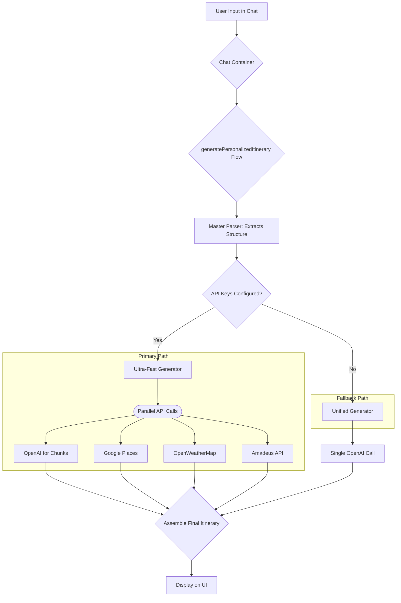

# Nomad Navigator: AI Processing Flow

This document provides a comprehensive overview of the AI-powered text processing pipeline that drives the Nomad Navigator application. It details how a user's natural language request is transformed into a structured, detailed travel itinerary.

## System Overview

The application's core intelligence is an **AI-powered text processing pipeline**. It is not a true Machine Learning system that learns over time, but rather a sophisticated, multi-step process that leverages pre-trained Large Language Models (LLMs) like OpenAI's GPT series, combined with several external APIs and custom data parsers.

The goal of the pipeline is to be:
- **Accurate**: By understanding the user's intent precisely.
- **Fast**: By using optimized models and parallel processing.
- **Reliable**: By having fallbacks and robust error handling.
- **Rich**: By enhancing AI-generated content with real-world, real-time data.

## Step-by-Step Itinerary Generation Flow

The process begins when a user submits a travel request and ends with a fully formed itinerary displayed in the UI.

### Step 1: User Input & Initial Call
-   **File:** `src/components/chat/chat-container.tsx`
-   **Action:** When a user submits their initial travel prompt, this component is responsible for initiating the AI process. It calls the main server-side function, `generatePersonalizedItinerary`, which kicks off the entire generation workflow.

### Step 2: The Central Orchestrator
-   **File:** `src/ai/flows/generate-personalized-itinerary.ts`
-   **Action:** This script is the "brain" of the operation, coordinating the entire process.
    1.  **Validation**: It first performs a quick complexity check on the user's prompt. It ensures the request does not exceed system limits (e.g., more than 5 destinations or a trip longer than 30 days). This prevents overly long and expensive AI calls.
    2.  **Intelligent Parsing**: It calls the `MasterTravelParser` to analyze the user's text and convert it into structured data.
    3.  **Strategy Selection**: Based on whether API keys for Google Places and OpenWeatherMap are configured in the environment, it intelligently chooses one of two generation engines:
        -   **Primary Engine**: `generateUltraFastItinerary` is used if external API keys are available. This provides the richest, most accurate data.
        -   **Fallback Engine**: `generateUnifiedItinerary` is used if API keys are missing. This relies solely on the AI's internal knowledge.

### Step 3: Text Parsing & Structuring (The "Intelligence" Layer)
-   **File:** `src/lib/utils/master-parser.ts` (and its helpers `date-parser.ts` & `input-validator.ts`)
-   **Action:** This is a critical step that makes the AI significantly more reliable. Instead of sending raw text to the AI, this script pre-processes it.
    -   It uses `validator.js` to sanitize input and prevent injection attacks.
    -   It uses `date-fns` to parse flexible, natural language dates (e.g., "next week", "mid-January", "Christmas holidays").
    -   It uses a series of robust regular expressions and pattern-matching rules to extract key entities like **destinations**, **trip duration**, and the user's **origin city**.
-   **Data Source**: The data processed here comes *exclusively* from the user's text prompt.
-   **Limitations**: This stage is rule-based, not true NLP or ML. It is highly effective but can fail on extremely unusual or ambiguous phrasing.

### Step 4: The Generation Engine (The "Ultra-Fast" Primary Path)
-   **File:** `src/ai/utils/enhanced-generator-ultra-fast.ts`
-   **Action:** This is the primary engine and the most complex part of the system. It is designed for maximum speed and data richness by running multiple tasks in parallel.
    1.  **Fast Extraction:** It first makes a quick, low-cost call to OpenAI's `gpt-3.5-turbo` model to get a basic JSON structure of the trip (destinations, days).
    2.  **Parallel Data Fetching:** It then launches multiple, simultaneous API calls to gather all necessary data:
        -   **OpenAI (`gpt-3.5-turbo`):** Generates the creative content (activity descriptions, day themes) for each destination *in separate, parallel chunks*. This is key to avoiding timeouts.
        -   **Google Places API:** Fetches real-world venue data (restaurants, museums, addresses, ratings) to ground the itinerary in reality.
        -   **OpenWeatherMap API:** Gets the 7-day weather forecast for each destination.
        -   **Amadeus API (if configured):** Searches for real-time flight and hotel price estimates.
    3.  **Data Assembly:** After all parallel calls complete, this script masterfully combines the AI-generated structure with the real-world API data to build the final, rich itinerary that is sent back to the user.
-   **Data Sources**: OpenAI, Google Places, OpenWeatherMap, Amadeus.
-   **Restrictions**: The performance of this engine depends on the reliability and speed of multiple external APIs. A sophisticated caching layer helps mitigate this, but it remains the most intricate part of the application.

### Step 5: The Fallback Generation Engine
-   **File:** `src/ai/utils/unified-generator.ts`
-   **Action:** This engine is used when external API keys are not available.
    -   It makes a single, large API call to the more powerful `gpt-4o-mini` model.
    -   It asks the AI to generate the entire itinerary based on its vast internal knowledge, without any real-time, external data verification.
-   **Data Source**: OpenAI only.
-   **Limitations**: This method is significantly slower, especially for long or multi-destination trips, and is the primary cause of the `504 Gateway Timeout` errors. The data is also less accurate (e.g., a recommended restaurant might have closed permanently) because it is not verified against live APIs.

---

## AI Processing Flowchart

